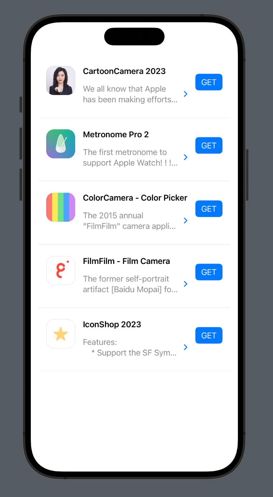

# MyApplications

Show your application informations.

```swift
import SwiftUI
import MyApplications

struct AppView: View {
    var body: some View {
        VStack {
            ApplicationInfoView(artistId: "Artist Id")
        }
        .padding()
    }
}
```

## Screenshot

